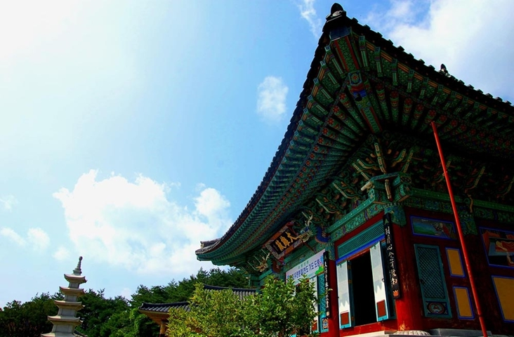
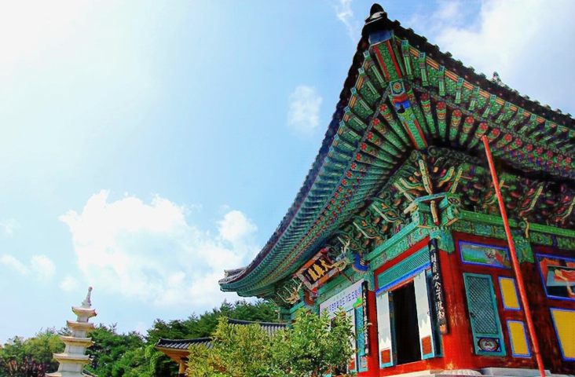

FRLIE: Low-light Image Enhancement via Feature Restoration
=================================
This is the PyTorch implementation of paper FRLIE: Low-light Image Enhancement via Feature Restoration

{:height="30%" width="30%"} {:height="30%" width="30%"}

Prerequisites
---------------------------------
* Python 3.7
* Pytorch 1.7
* NVIDIA GPU + CUDA cuDNN

Installation
---------------------------------
* Clone this repo:
```
git clone https://github.com/YaN9-Y/FRLIE

```
* Install Pytorch
* Install python requirements:
```
pip install -r requirements.txt
```

### 0.Quick Testing
To hold a quick-testing of our model, just run:
```
python3 test.py --model 2 --checkpoints ./checkpoints/quick_test
```
and check the results in `checkpoints/quick_test/results/feature_process`.

This is a coarse version of our code for preview. We will tidy up and release a finer version after the paper is accepted.
